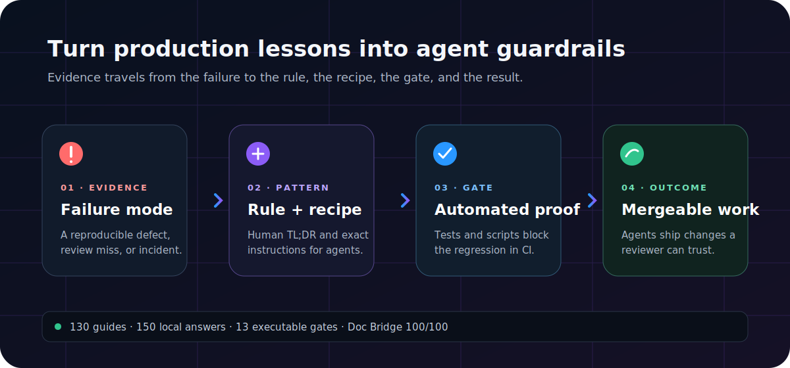
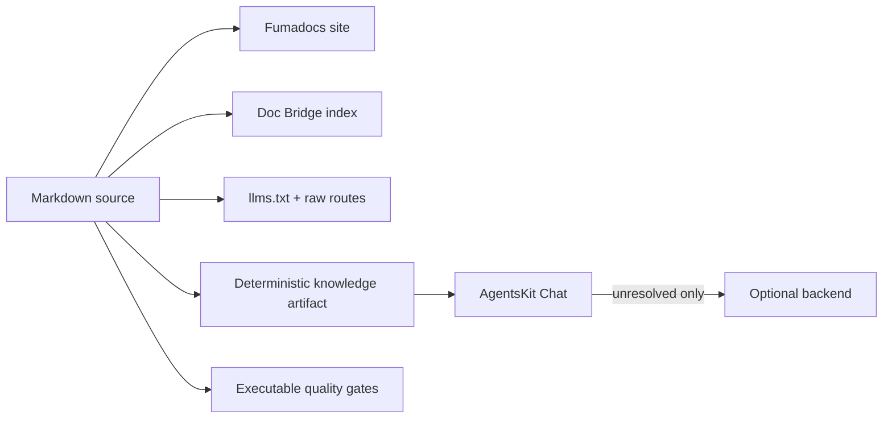

<p align="center">
  
</p>

<h1 align="center">Agents Playbook</h1>

<p align="center">
  Production-earned rules, executable gates, and copy-ready templates for software built with AI coding agents.
</p>

<p align="center">
  <a href="https://playbook.agentskit.io"></a>
  <a href="./LICENSE"></a>
  <a href="./doc-bridge.config.json"></a>
  <a href="./public/deterministic/knowledge.json"></a>
</p>

Agents Playbook turns hard-won engineering lessons into instructions that both people and LLMs can apply. Use it to establish project rules, design package boundaries, review agent-authored changes, and enforce quality before merge—without inventing a governance system from scratch.

It is intended for engineering teams adopting coding agents, maintainers standardizing many repositories, and agents that need structured, retrievable operational context.



## What is verified

The repository generates and checks its own claims from source:

| Surface | Current proof |
|---|---:|
| Production patterns | 87 |
| Engineering pillars | 6 |
| SDLC phases | 6 |
| Copy-ready templates | 6 |
| Zero-dependency gate scripts | 13 |
| Human and agent guides | 131 |
| Deterministic local answers | 153 |
| Doc Bridge health | 100/100 · A |

The source-of-truth counts live in [`app/stats.snapshot.json`](./app/stats.snapshot.json), the local answer catalog in [`public/deterministic/knowledge.json`](./public/deterministic/knowledge.json), and documentation ownership in [`doc-bridge.config.json`](./doc-bridge.config.json). CI rejects drift.

## Start in five minutes

Requirements: Node.js 22 and pnpm 9.

```bash
pnpm install --frozen-lockfile
pnpm dev
```

Open `http://localhost:3000`. If you are new to agent governance, follow [Getting started](https://playbook.agentskit.io/docs/getting-started), copy the [AGENTS.md template](https://playbook.agentskit.io/docs/templates/AGENTS.md.template), and add one relevant gate before expanding the policy set.

For an LLM, use [`/llms.txt`](https://playbook.agentskit.io/llms.txt) for the map, [`/llms-full.txt`](https://playbook.agentskit.io/llms-full.txt) for the complete corpus, or replace `/docs/<path>` with `/raw/<path>.md` for a single source document.

## Verify the local knowledge layer

The Ask experience resolves exact, aliased, and ambiguous documentation questions from a content-addressed, hash-verified static artifact before considering the optional backend. Run the same protocol verification locally:

<!-- readme-command:verify-local-knowledge -->
```bash
node examples/verify-playbook.mjs
```

<!-- readme-example:verify-playbook -->
```js
import { readFileSync } from 'node:fs'
import { decodeDeterministicSiteConfig, verifyLocalKnowledgeArtifactSync } from '@agentskit/chat/protocol'

const config = JSON.parse(readFileSync(new URL('../public/deterministic/site-config.json', import.meta.url)))
const artifact = JSON.parse(readFileSync(new URL('../public/deterministic/knowledge.json', import.meta.url)))
const site = decodeDeterministicSiteConfig(config)
if (!site.ok) throw new Error(site.diagnostic.message)
const verified = verifyLocalKnowledgeArtifactSync(artifact, {
  expectedContentHash: site.value.artifact.contentHash,
  expectedSiteId: site.value.siteId,
})
if (!verified.ok) throw new Error(verified.diagnostic.message)
console.log(`Verified ${verified.value.entries.length} local Playbook answers.`)
```

Expected output:

```text
Verified 153 local Playbook answers.
```

## How the system fits together



- **Humans** get a searchable Fumadocs journey, visual explanations, examples, and contribution paths.
- **LLMs** get stable raw Markdown, full-corpus exports, explicit ownership, and machine-readable local answers.
- **Maintainers** get generated statistics, Doc Bridge routing, README certification, tests, and build gates.
- **Visitors** can use Ask immediately for deterministic questions; backend calls happen only when local evidence cannot answer safely.

See [Discovery and Ask](https://playbook.agentskit.io/docs/discovery) for the decision path, integrity checks, privacy behavior, and failure modes.

## Repository map

| Path | Purpose |
|---|---|
| [`content/docs`](./content/docs) | Canonical guides, phases, prompts, and templates |
| [`content/docs/scripts`](./content/docs/scripts) | Runnable, zero-dependency reference gates |
| [`components/ask-widget.tsx`](./components/ask-widget.tsx) | Local-first AgentsKit Chat integration |
| [`scripts`](./scripts) | Generation and quality verification |
| [`public/deterministic`](./public/deterministic) | Verified static knowledge and site configuration |
| [`.doc-bridge`](./.doc-bridge) | Generated agent-routing index and capabilities |

## Quality commands

```bash
pnpm test
pnpm check:okf-type
pnpm check:doc-bridge-config
pnpm docs:bridge:index
pnpm docs:bridge:gate
pnpm check:readme-standard
pnpm lint
pnpm build
```

The corpus is usable as versioned documentation today. The web application is currently `0.1.x`; consumers should treat internal React components as private and depend on the published document and machine routes instead.

## Contribute a production lesson

Contributions are welcome when a pattern is grounded in a real failure mode, explains its enforcement, and remains useful across tools. Read [`CONTRIBUTING.md`](./CONTRIBUTING.md), then use the [contribution guide](https://playbook.agentskit.io/docs/contributing) to validate structure, cross-links, machine retrieval, and gates.

By contributing, you license the work under [CC BY 4.0](./LICENSE). Please report security concerns through the policy of the affected AgentsKit repository rather than a public issue.

## AgentsKit ecosystem

Agents Playbook is the practice layer of the AgentsKit ecosystem:

- [AgentsKit](https://www.agentskit.io/docs) — build agents without gluing many libraries together.
- [Registry](https://registry.agentskit.io/docs) — copy ready-made agents and own the source.
- [AgentsKit Chat](https://chat.agentskit.io/docs) — define one conversational experience across interfaces.
- [Doc Bridge](https://agentskit-io.github.io/doc-bridge/) — turn repository docs into executable agent handoffs.
- [Code Review CLI](https://github.com/AgentsKit-io/code-review-cli#readme) — verify agent-authored changes before merge.
- [AKOS](https://akos.agentskit.io/docs) — run and govern agents in production.

**Topics:** `ai-agents` · `coding-agents` · `agent-governance` · `software-architecture` · `quality-gates` · `fumadocs` · `llms-txt` · `developer-experience`
