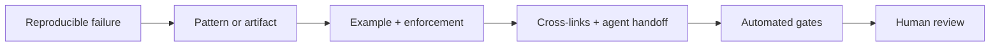

# Contribute a production-earned pattern

The Playbook grows from evidence, not taste. A strong contribution starts with a failure you can reproduce, names the rule that prevents it, and includes a way to verify the rule in practice.

## Choose the right contribution

| You have… | Contribute… | Include… |
|---|---|---|
| a recurring engineering failure | a pattern | trigger, rule, failure mode, enforcement |
| a reliable agent instruction | a prompt | role, inputs, outputs, refusal boundary |
| a durable document shape | a template | required sections and lifecycle |
| an automatable invariant | a gate script | actionable failure output and clean exit behavior |
| a correction or clearer explanation | a docs fix | source or reproduction showing why |

## Quality bar

1. Explain the human outcome in plain language.
2. Give agents unambiguous instructions and concrete paths.
3. Link the real incident, repeated defect, measurement, or upstream contract that earned the rule.
4. Add copy-ready examples that a reader can run or adapt.
5. Identify when the pattern does **not** apply.
6. Update related pages instead of leaving duplicate or contradictory guidance.
7. Run the corpus, Doc Bridge, deterministic artifact, README, and production-build gates.

## Contribution flow

Read the repository [CONTRIBUTING guide](https://github.com/AgentsKit-io/agents-playbook/blob/main/CONTRIBUTING.md), open a focused pull request, and describe both the promise and the proof. The corpus is licensed under [CC-BY-4.0](https://github.com/AgentsKit-io/agents-playbook/blob/main/LICENSE), so teams may adapt it with attribution.

If your contribution is a ready-to-run agent rather than an engineering practice, submit it to the [AgentsKit Registry](https://registry.agentskit.io). If it improves the shared chat runtime, contribute to [AgentsKit Chat](https://github.com/AgentsKit-io/agentskit-chat). If it improves repository-to-agent documentation routing, contribute to [Doc Bridge](https://github.com/AgentsKit-io/doc-bridge).

For a repeatable review of an agent-authored pull request before submission, use the [AgentsKit Code Review CLI](https://github.com/AgentsKit-io/code-review-cli) and feed any reusable production lesson back into this Playbook.
