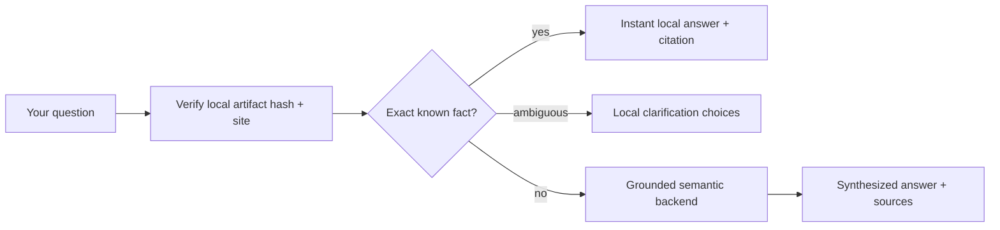

# Local-first pattern discovery

Ask Playbook checks a content-addressed, hash-verified, bounded snapshot of the public corpus **before** it makes a network request. Known pattern names, page paths, prompts, templates, scripts, phases, and ecosystem links answer instantly with canonical citations. Questions that need interpretation or adaptation use the configured backend.

## What stays local

These examples require zero backend calls:

| Ask | Result |
|---|---|
| `ADR Pattern` | Canonical pattern summary, guide, and raw source |
| `system-architect` | Copy-ready system prompt source |
| `check-no-any.example.mjs` | Gate purpose, source, and run command |
| `onboard my agent` | The verified onboarding journey |
| `universal` | Clarification choices across the relevant pillars |

The artifact includes every human/agent document plus all 13 executable gate scripts. It is generated from repository truth, validated with `@agentskit/chat-protocol`, content-addressed with SHA-256, and kept below the protocol size limit.

## What uses the backend

Requests such as “adapt the security and governance patterns to my Rust monorepo” need synthesis. The deterministic resolver records a miss, passes bounded context to the trusted `playbook` corpus, and lets the backend combine cited sources.

The footer tells you which path produced the answer:

- **instant · local** — exact, verified local knowledge;
- **consulting backend** — an escalation is in progress or failed before proof;
- **grounded · backend** — a backend answer completed successfully.

No failed stream is labelled grounded.

## Failure and privacy behavior

- The artifact loads only when you hover, focus, or open the assistant, so it does not inflate every initial page response.
- A transient artifact failure falls back safely to the backend and retries after a short cooldown on a later interaction.
- A corrupt or wrong-site artifact is rejected; it never becomes trusted context.
- Exact questions do not leave the browser when the local artifact is available and passes verification; degraded mode is visibly labelled and may use the backend.
- The browser selects neither corpus authority nor backend model.

## Machine endpoints

- [Site configuration](/deterministic/site-config.json)
- [Knowledge artifact](/deterministic/knowledge.json)
- [LLM site map](/llms.txt)
- [Full Playbook bundle](/llms-full.txt)
- [ZIP bundle](/playbook-bundle.zip)

For the reusable framework boundary, see [AgentsKit Chat dogfood](/docs/agentskit-chat). For repository routing and agent handoffs, use [Doc Bridge](https://github.com/AgentsKit-io/doc-bridge).
