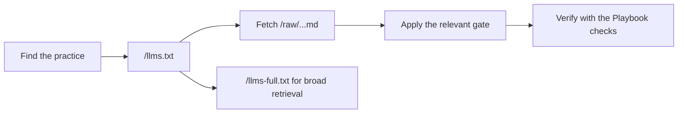

# For agents

Use the smallest surface that answers the task. Start with the map, fetch raw pages for focused work, and use the full bundle only for indexing or cross-cutting audits.

<Cards>
  <Card title="Focused task" href="/llms.txt">
    Choose a guide from the concise machine-readable map, then fetch its raw Markdown URL.
  </Card>
  <Card title="Repository-wide audit" href="/llms-full.txt">
    Load the deterministic full bundle when the task spans multiple pillars or phases.
  </Card>
  <Card title="Ownership and handoff" href="https://doc-bridge.agentskit.io/">
    Use Doc Bridge for ownership, health gates, agent handoffs, and documentation routing.
  </Card>
  <Card title="Interactive guidance" href="/docs/agentskit-chat">
    Ask Playbook composes AgentsKit Chat while keeping answers grounded in this corpus.
  </Card>
</Cards>

## Retrieval contract

1. Read [`/llms.txt`](/llms.txt) and select only the relevant guide.
2. Fetch the guide from its `/raw/` URL; raw content is the source used by machine consumers.
3. Preserve the guide's human TL;DR, For Agents sections, invariants, failure modes, and verification steps.
4. Run the checks named by the guide and repository `AGENTS.md` before reporting completion.
5. For broad indexing, use [`/llms-full.txt`](/llms-full.txt) or the [ZIP bundle](/playbook-bundle.zip).

## Ecosystem routing

| If the task is about… | Continue with… |
|---|---|
| Building an agent | [AgentsKit](https://www.agentskit.io/docs) |
| Starting from ready-made source | [Registry](https://registry.agentskit.io/docs) |
| Reusable chat or conversational UI | [AgentsKit Chat](https://chat.agentskit.io/docs) |
| Documentation ownership or agent handoffs | [Doc Bridge](https://doc-bridge.agentskit.io/) |
| Review before merge | [AgentsKit Code Review](https://github.com/AgentsKit-io/code-review-cli#readme) |
| Enterprise governance and production operation | [AKOS](https://akos.agentskit.io/docs) |
