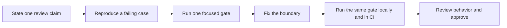

# Review agent-authored pull requests with executable evidence

An agent can produce a convincing pull request description without producing a safe change. The useful question is not *who wrote the diff?* It is: **can another person reproduce the claim before approving it?**

This guide turns one common review instruction — “do not add unsafe TypeScript `any`” — into evidence that runs the same way on a maintainer's machine and in CI. The workflow is local, open source, and independent of the model or coding agent that produced the change.

## What you will prove

In about 15 minutes, you will:

1. reproduce a structural defect in a synthetic change;
2. run one focused Agents Playbook gate;
3. replace `any` with `unknown` and narrow it at the boundary;
4. rerun the gate locally;
5. require the same command in GitHub Actions; and
6. attach a small, reviewable evidence block to the pull request.

You need Node.js 22 or newer and a Git repository. The CLI has zero runtime dependencies and does not call an AI provider.

## 1. Start with the claim, not the diff

Assume an agent proposes this boundary:

```ts title="src/parse-response.ts"
export function parseResponse(value: any): string {
  return value.message
}
```

The code is short and may pass a happy-path test. The risk is still concrete: the boundary accepts an unchecked value and assumes `message` exists.

Write the review claim in a form a gate can answer:

> Public TypeScript boundaries must not introduce unapproved `any` types.

This is narrower and more useful than “improve type safety.” It names one invariant and has an observable pass or fail result.

## 2. Reproduce the failure locally

From the repository root, run only the relevant gate:

```bash
npx @agentskit/playbook@0.1.1 run no-any
```

The command exits non-zero and reports the file, line, rule, and recovery direction. A failed run is valuable evidence: it proves the check can detect the defect instead of merely going green on the final code.

Use `npx @agentskit/playbook@0.1.1 explain no-any` when a reviewer or contributor needs the rule's purpose and configuration key.

## 3. Fix the boundary

Replace `any` with `unknown`, then narrow before reading the value:

```ts title="src/parse-response.ts"
type MessageResponse = {
  message: string
}

function isMessageResponse(value: unknown): value is MessageResponse {
  if (typeof value !== 'object' || value === null) return false
  return 'message' in value && typeof value.message === 'string'
}

export function parseResponse(value: unknown): string {
  if (!isMessageResponse(value)) throw new TypeError('Response must contain a message')
  return value.message
}
```

Run the exact gate again:

```bash
npx @agentskit/playbook@0.1.1 run no-any
```

The command now exits zero. Review the code as well: a green structural gate proves the absence of unapproved `any`; it does **not** prove that the parser is correct for every input or that the product behavior is safe.

## 4. Make the rule repeatable in CI

Use the same package version and command in GitHub Actions:

```yaml title=".github/workflows/agent-review.yml"
name: Agent review gates

on:
  pull_request:

permissions:
  contents: read

jobs:
  structural-gates:
    runs-on: ubuntu-latest
    steps:
      - uses: actions/checkout@v4
      - uses: actions/setup-node@v4
        with:
          node-version: 22
      - run: npx --yes @agentskit/playbook@0.1.1 run no-any
```

Pinning the version keeps local and CI behavior aligned. Upgrade it deliberately in a separate, reviewable change.

Once the first gate is useful, expand gradually instead of enabling every rule at once:

```bash
npx @agentskit/playbook@0.1.1 run no-any named-exports secrets
```

Use [the gate reference](/docs/scripts) to choose invariants that match your repository. A rule that does not match your architecture should be configured or left disabled, not adopted for the appearance of coverage.

## 5. Record evidence in the pull request

Add a compact section that reviewers can verify:

```md
## Executable review evidence

- Claim: public TypeScript boundaries introduce no unapproved `any`.
- Failure reproduced: `no-any` rejected `src/parse-response.ts` before the fix.
- Fix: changed the boundary to `unknown` and added runtime narrowing.
- Local result: `npx @agentskit/playbook@0.1.1 run no-any` passes.
- CI result: `Agent review gates / structural-gates` passes on this commit.
- Remaining review: validate parser behavior and error handling against product requirements.
```

This block distinguishes three things that are often blurred together:

| Evidence | What it proves | What it does not prove |
|---|---|---|
| failing gate before the fix | the check detects this defect | the gate detects every defect |
| passing gate after the fix | the named invariant currently holds | the feature is correct |
| human review | the change fits its intended behavior and context | future changes cannot regress |

## 6. Scale the workflow without trusting a tool blindly

Apply the same loop to each invariant:



Keep these boundaries explicit:

- A coding agent may propose the claim, change, or test, but it must not approve its own evidence.
- A gate should fail with a path, line, rule, and recovery direction.
- Local and CI commands should be identical.
- Escape hatches must be named, justified, and budgeted.
- Passing gates reduce review uncertainty; they do not transfer accountability to the tool.

For broader adoption, combine this workflow with the [PR Intent Pattern](/docs/pillars/governance/pr-intent-pattern), the [Quality Gates Pattern](/docs/pillars/quality/quality-gates-pattern), and the [reference scripts](/docs/scripts). Start with one recurring failure, prove the gate catches it, and only then add another rule.

## Contribution opportunity

If this workflow exposes a recurring failure that the Playbook does not cover, contribute the smallest reusable artifact: a reproduction, one invariant, an actionable gate, and the evidence that it fails before the fix and passes afterward. See [Contribute a production-earned pattern](/docs/contributing).
